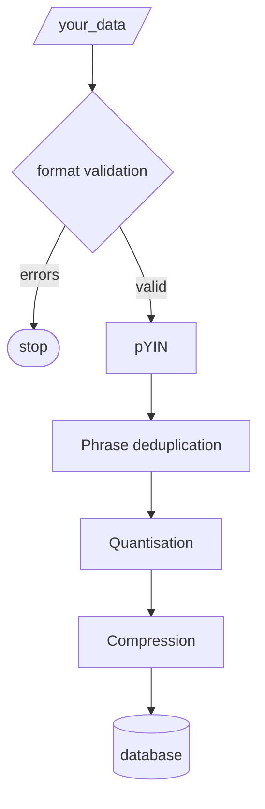

# Strawberry Fields database

Pitch tracks and metadata for Strawberry Fields, built from any folder of recordings
laid out as described below. Every recording is tracked, stripped of the phrases its
performer states more than once, and packed into one row of a PostgreSQL table. Each
row holds:

| Column | Type |
|---|---|
| `title` | text |
| `raga` | text |
| `tala` | text |
| `pitch_track` | bytea, contour in cents on a 0.2 s grid at 0.87 bytes a frame |

The packed format is documented in [`pitchtrack/codec.py`](pitchtrack/codec.py), and
the pipeline in [`pitchtrack/__init__.py`](pitchtrack/__init__.py).

## Pipeline


```mermaid
flowchart TD
    Data[/"your_data"/]
    Validate{"format validation"}
    Stop([stop])
    Extract["pYIN"]
    Dedupe["Phrase deduplication"]
    Quantise["Quantisation"]
    Compress["Compression"]
    Database[("database")]

    Data --> Validate
    Validate -->|errors| Stop
    Validate -->|valid| Extract
    Extract --> Dedupe
    Dedupe --> Quantise
    Quantise --> Compress
    Compress --> Database
```

## Setup

```bash
git clone https://github.com/vivekvjyn/Strawberry-Fields.git
cd Strawberry-Fields
git switch database
pip install -r requirements.txt
```

The pipeline reads any folder of recordings; `your_data` is the folder you pass on the
command line. One folder per recording, each holding `audio.mp3` and `metadata.json`:

```text
your_data/
├── song-001/
│   ├── audio.mp3
│   └── metadata.json
└── song-002/
    ├── audio.mp3
    └── metadata.json
```

```json
{"title": "Song 1", "raga": "Raga 1", "tala": "Tala 1"}
```

`title`, `raga` and `tala` are strings: one raga and one tala to a song. The folder's
name identifies the song, because titles are not unique. Saraga's export spells those
two fields `raaga` and `taala` and wraps each in a list of one, and both spellings and
a list of one are read as that one name.

Credentials go in `.env`:

```makefile
DB_HOST=your_host
DB_NAME=your_database
DB_USER=your_username
DB_PASSWORD=your_password
DB_PORT=your_port
SECRET_KEY=your_secret_key
```

## Run

```bash
python scripts/verify_data.py your_data
python scripts/migrate.py
python scripts/build_pitch_tracks.py your_data
python scripts/load_tracks.py
```

`verify_data.py` checks every song folder of the corpus and prints every problem it
finds, not just the first one. An error, printed in red, stops a build; a warning,
printed in yellow, is worth a look but does not. `build_pitch_tracks.py` runs the same
check before it starts, so a broken copy is found in one run rather than one fault per
run. All four commands report through Rich: progress bars, a table of problems, and a
table of measurements.

## Licence

This project is licensed under the MIT License. See [LICENSE](LICENSE).
