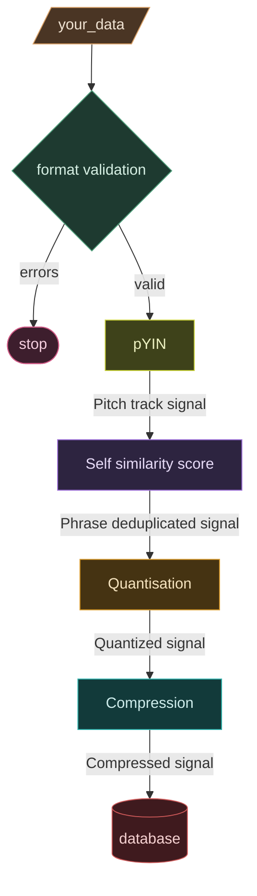

# Strawberry Fields database

Scripts for setting up the [Strawberry Fields](https://github.com/vivekvjyn/Strawberry-Fields)
database:

| Column | Type |
|---|---|
| `title` | text |
| `raga` | text |
| `tala` | text |
| `pitch_track` | bytea |

## Pipeline


```mermaid
flowchart TD
    Data[/"your_data"/]:::data
    Validate{"format validation"}:::check
    Stop([stop]):::stop
    Extract["pYIN"]:::pyin
    Dedupe["Self similarity score"]:::similarity
    Quantise["Quantisation"]:::quantise
    Compress["Compression"]:::compress
    Database[("database")]:::store

    Data --> Validate
    Validate -->|errors| Stop
    Validate -->|valid| Extract
    Extract --> |Pitch track signal| Dedupe
    Dedupe --> |Phrase deduplicated signal| Quantise
    Quantise --> |Quantized signal| Compress
    Compress --> |Compressed signal| Database

    classDef data fill:#4a3524,stroke:#d9a066,color:#f0e3d3
    classDef check fill:#1e3a30,stroke:#4e9e7a,color:#d6efe3
    classDef stop fill:#3d1e2d,stroke:#d05a86,color:#f4cede
    classDef pyin fill:#3e421a,stroke:#c9d13b,color:#eef2c2
    classDef similarity fill:#2d2440,stroke:#9b6dd6,color:#e7dbf7
    classDef quantise fill:#453312,stroke:#d99a2b,color:#f6e4bf
    classDef compress fill:#123a3a,stroke:#2fb3ad,color:#cfedec
    classDef store fill:#3f1a1e,stroke:#d05a5a,color:#f6d2d2
```

## Setup

```bash
git clone https://github.com/vivekvjyn/Strawberry-Fields.git
cd Strawberry-Fields
git switch database
pip install -r requirements.txt
```

**Dataset format**: `your_data` is the folder you pass on the
command line. Each recording is one folder holding `audio.mp3` and `metadata.json`:

```text
your_data/
├── song-001/
│   ├── audio.mp3
│   └── metadata.json
└── song-002/
    ├── audio.mp3
    └── metadata.json
```
**Metadata format**
```json
{"title": "Song 1", "raga": "Raga 1", "tala": "Tala 1"}
```

Credentials go in `.env`:

```makefile
DB_HOST=your_host
DB_NAME=your_database
DB_USER=your_username
DB_PASSWORD=your_password
DB_PORT=your_port
SECRET_KEY=your_secret_key
```

## Run

```bash
python scripts/verify_data.py your_data
python scripts/migrate.py
python scripts/build_pitch_tracks.py your_data
python scripts/load_tracks.py
```

## Licence

This project is licensed under the MIT License. See [LICENSE](LICENSE).
